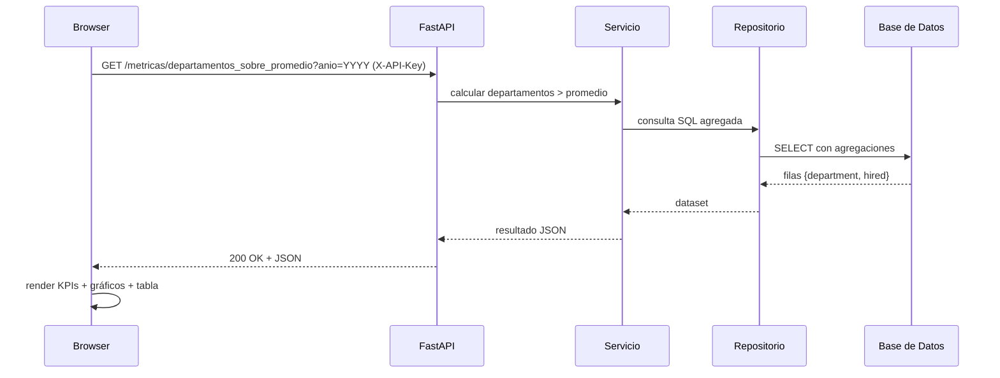

# Servicio de Ingesta de Datos (FastAPI + PostgreSQL)

Diseñé este servicio REST para ingesta, validación, respaldo y restauración de datos sobre PostgreSQL, con foco en trazabilidad y seguridad. Soporta cargas por lotes, validación con modelos de datos (Pydantic), reglas de calidad específicas, y generación/restauración de respaldos en AVRO o PARQUET. Mi objetivo fue que pudieras levantarlo rápido (Docker o local), probarlo desde Swagger o la UI, y auditar de forma clara qué se procesa y qué no.

## Descripción
- Orígenes de datos: archivos CSV (para importaciones históricas) y cargas REST en JSON.
- Destino: PostgreSQL (local, Docker o Azure PostgreSQL).
- Funcionalidades: ingesta, validación, respaldos, restauración y borrado seguro condicionado a respaldos existentes.
- Stack: Python (FastAPI, Pydantic, psycopg2, python-dotenv) y pyarrow/fastavro para formatos.

Seguridad y acceso
- Autenticación: API key vía cabecera `X-API-Key` si `API_KEY` está definido en `.env`.
- Rate limiting: ventana `RATE_LIMIT_WINDOW_SECONDS` y máximo `RATE_LIMIT_MAX_REQUESTS` por IP.
- CORS: orígenes permitidos con `ALLOWED_ORIGINS` (coma separada o `*`).
- UI: sirvo el JS desde `GET /static/ui.js`. En `/ui` puedes introducir la API key; si defines `EXPOSE_API_KEY_IN_UI=true`, el campo se prellena con `API_KEY` (solo para demos, no producción).

Variables en `.env`
- `API_KEY="tu_clave_segura"`
- `EXPOSE_API_KEY_IN_UI=false` (true para prellenar `/ui`)
- `ALLOWED_ORIGINS="http://127.0.0.1:8000,http://localhost:8000"` (o `*`)
- `RATE_LIMIT_WINDOW_SECONDS=60`
- `RATE_LIMIT_MAX_REQUESTS=100`
- `DB_SSLMODE=require` (para Azure PostgreSQL; opcional en local)

Uso rápido con API key
- Inicia el servidor: `py -m uvicorn fast_api_con_rest:app --host 127.0.0.1 --port 8000`.
- Abre `http://127.0.0.1:8000/ui` y coloca tu API key en el campo superior. Si `EXPOSE_API_KEY_IN_UI=true`, verás el campo prellenado.
- Envía transacciones y genera respaldos; la cabecera `X-API-Key` se incluirá automáticamente.

Nota sobre UI estática
- El archivo `static/ui.js` encapsula la lógica de la UI. Si modificas el JS, no necesitas cambiar `fast_api_con_rest.py`.
 
 Advertencia
- No uses `EXPOSE_API_KEY_IN_UI=true` en producción: mostrará tu API key en el navegador. Úsalo solo para entornos locales/demos.

## Requisitos
- Python 3.11 o superior.
- PostgreSQL accesible con credenciales válidas.
- Paquetes Python: `fastapi`, `uvicorn`, `pydantic`, `psycopg2`, `python-dotenv`, `pyarrow`, `fastavro`.

## Docker y Docker Compose
- Archivos:
  - `Dockerfile`: imagen de la app.
  - `docker-compose.yml`: orquesta `app` y `db` (PostgreSQL local).
  - `.env.example`: referencia de variables; copia a `.env` y ajusta.

## Evaluación rápida

Para validar rápidamente el servicio, recomiendo dos modos de ejecución. En ambos casos, copia `.env.example` a `.env` primero.

### Opción A: Docker Compose (recomendado)

1) Copia `.env.example` a `.env` y déjalo con valores de demo:

```
DB_NAME=prueba_tecnica
DB_USER=prueba_user
DB_PASSWORD=prueba_pass
API_KEY=clave-demo-123
EXPOSE_API_KEY_IN_UI=true
ALLOWED_ORIGINS=http://127.0.0.1:8000,http://localhost:8000
RATE_LIMIT_WINDOW_SECONDS=60
RATE_LIMIT_MAX_REQUESTS=100
```

2) Levanta servicios:

```
docker compose up -d --build
```

3) Verifica salud y documentación:

```
http://127.0.0.1:8000/healthz
http://127.0.0.1:8000/docs
```

4) En Swagger, pulsa “Authorize” y usa `X-API-Key=clave-demo-123`. La UI de pruebas está en `http://127.0.0.1:8000/ui` y prellenará la API key si `EXPOSE_API_KEY_IN_UI=true`.
5) Valida endpoints de seguridad: sin `X-API-Key` verás `401`; con la clave correcta, acceso permitido. Healthcheck responde `ok` cuando la app y DB están accesibles.

### Opción B: Local (sin Docker)

1) Copia `.env.example` a `.env` y ajusta credenciales de tu PostgreSQL local:

```
DB_NAME=prueba_tecnica
DB_USER=postgres        # o tu usuario
DB_PASSWORD=<tu_password>
DB_HOST=localhost
DB_PORT=5432
API_KEY=clave-demo-123
EXPOSE_API_KEY_IN_UI=true
ALLOWED_ORIGINS=http://127.0.0.1:8000,http://localhost:8000
RATE_LIMIT_WINDOW_SECONDS=60
RATE_LIMIT_MAX_REQUESTS=100
```

2) Arranca el servidor:

```
py -m uvicorn fast_api_con_rest:app --host 127.0.0.1 --port 8000 --reload
```

3) Verifica salud y usa Swagger/UI como en la opción A.

Tips rápidos de validación
- Health: `http://127.0.0.1:8000/healthz` → `ok`.
- Swagger: `http://127.0.0.1:8000/docs`.
- UI: `http://127.0.0.1:8000/ui`.
- Seguridad: prueba `X-API-Key` correcto/incorrecto.

### Pruebas de datos y respaldos

- Importo CSV históricos con lotes y `COPY FROM` con:

```
py modelos.py
```

- Genero respaldos por tabla desde la UI o con curl/PowerShell, y puedo restaurar desde AVRO/PARQUET con el endpoint `/restaurar`.

### Seguridad

- La API requiere `X-API-Key` (si `API_KEY` está definido). Sin clave, devolverá `401`.
- CORS restringido a localhost por defecto (`ALLOWED_ORIGINS`).
- Rate limiting moderado configurable (`RATE_LIMIT_WINDOW_SECONDS`, `RATE_LIMIT_MAX_REQUESTS`).

> Nota: No uses `EXPOSE_API_KEY_IN_UI=true` en producción.

### Ejecutar solo la app con Docker
1. Copia `.env.example` a `.env` y ajusta credenciales (si usarás una DB externa).
2. Construye la imagen:
   - `docker build -t prueba-tecnica-app .`
3. Ejecuta el contenedor apuntando a tu DB:
   - `docker run --rm -p 8000:8000 --env-file .env prueba-tecnica-app`
4. Verifica salud:
   - `http://127.0.0.1:8000/healthz` debe responder `ok`.

### Desarrollo con Compose (app + PostgreSQL)
1. Copia `.env.example` a `.env`:
   - `DB_NAME=prueba_tecnica`
   - `DB_USER=prueba_user`
   - `DB_PASSWORD=prueba_pass`
   - El servicio `db` usará estas variables.
2. Levanta los servicios:
   - `docker compose up --build`
3. Accede a la app:
   - `http://127.0.0.1:8000/ui` y `http://127.0.0.1:8000/docs`
4. Healthcheck:
   - Compose verifica `http://localhost:8000/healthz`.
5. Persistencia:
   - Los datos de PostgreSQL se guardan en el volumen `pgdata`.

Notas
- El contenedor `app` monta el proyecto (`.:/app`) para desarrollo rápido.
- En producción, recomiendo no montar el proyecto y usar imágenes inmutables.
- `.dockerignore` reduce el contexto de build y excluye `.env` y archivos generados.

## Configuración
1. Crear el archivo `.env` en la raíz con estas variables:
   - `DB_NAME=tu_base`
   - `DB_USER=tu_usuario`
   - `DB_PASSWORD=tu_password`
   - `DB_HOST=localhost`
   - `DB_PORT=5432`
2. Verifica que PostgreSQL esté corriendo y accesible.

## Inicio rápido
- Arranca el servidor en Windows:
  - `py -m uvicorn fast_api_con_rest:app --host 127.0.0.1 --port 8000`
- UI del servicio:
  - `http://127.0.0.1:8000/ui`
- Documentación interactiva (Swagger):
  - `http://127.0.0.1:8000/docs`

## Endpoints principales
- `POST /transacciones`: recibir registros por tabla (uno o varios grupos).
- `POST /respaldos`: generar respaldos AVRO/PARQUET por tabla.
- `GET /respaldos/existe`: listar respaldos disponibles.
- `DELETE /limpiar_tabla`: borrar una tabla si existen respaldos recientes.
- `POST /restaurar`: restaurar una tabla desde un respaldo.
- `GET /metricas/contrataciones_por_trimestre`: métricas del Desafío #2.

## Lotes y validaciones
- Cada grupo en `/transacciones` acepta entre 1 y 1000 registros.
- Validación con Pydantic por tabla:
  - `departamentos`: `id > 0`, `departamento` (1–50).
  - `trabajos`: `id > 0`, `trabajo` (1–200).
  - `empleados_contratados`: `id > 0`; `nombre` y `fecha_hora` son opcionales; `id_departamento` e `id_trabajo` son opcionales (permiten `NULL`), pero si vienen deben ser `> 0` y existir como FK.
- Reglas de negocio: no inserto registros que no cumplan el esquema o las reglas de calidad. En su lugar, devuelvo un resumen con `errores_modelo` y/o `errores_calidad` en la respuesta del endpoint. Por defecto no persisto un log en disco/BD; si necesitas auditoría persistente, puedo habilitarla.
- Inserción/actualización: uso UPSERT en lote con `page_size = 1090` para eficiencia.

## Respaldos y restauración
- Para respaldos: se exporta el contenido completo de cada tabla (`SELECT *`).
- Formatos:
  - PARQUET: recomendado, soporta `NULL` en FKs de empleados.
  - AVRO: válido para la mayoría de casos; si los datos de empleados incluyen `NULL` en FKs, prefiera PARQUET.
- Restauración:
  - Lee el archivo, valida contra modelos, aplica reglas de calidad y realiza UPSERT.
  - Respuesta indica `recibidos`, `validos`, `restaurados` y detalla errores de modelo/calidad.

## Importación desde CSV
- Estructura CSV separada por comas.
- CSV de ejemplo incluidos: `departments.csv`, `jobs.csv`, `hired_employees.csv`.
- El servicio REST espera JSON; los CSV históricos pueden integrarse vía scripts auxiliares (ver `modelos.py` para inserciones en lote mediante `COPY FROM`).

## Ejemplo de uso de /transacciones
Payload JSON para cargar departamentos, trabajos y empleados (con FKs nulas permitidas):

```json
{
  "departamentos": [
    { "id": 10, "departamento": "Ingeniería" },
    { "id": 20, "departamento": "Recursos Humanos" }
  ],
  "trabajos": [
    { "id": 100, "trabajo": "Desarrollador Senior" },
    { "id": 200, "trabajo": "Gerente de Contratación" }
  ],
  "empleados_contratados": [
    {
      "id": 1,
      "nombre": "Juan Perez",
      "fecha_hora": "2023-01-15T10:00:00",
      "id_departamento": 10,
      "id_trabajo": 100
    },
    {
      "id": 2,
      "nombre": "Maria Garcia",
      "fecha_hora": "2023-02-20T11:30:00",
      "id_departamento": 20,
      "id_trabajo": 200
    },
    {
      "id": 3,
      "nombre": "Carlos Lopez",
      "fecha_hora": "2023-03-01T09:00:00",
      "id_departamento": null,
      "id_trabajo": 100
    },
    {
      "id": 4,
      "nombre": "Ana Martinez",
      "fecha_hora": "2023-04-10T14:00:00",
      "id_departamento": 10,
      "id_trabajo": null
    },
    {
      "id": 5,
      "nombre": "Pedro Sanchez",
      "fecha_hora": "2023-05-05T16:00:00",
      "id_departamento": null,
      "id_trabajo": null
    }
  ]
}
```

- En Swagger (`/docs`): usa "Try it out" en `POST /transacciones` y pega el JSON.
- En la UI (`/ui`): hay acciones para generar respaldos, listar y restaurar.

Validación de resultados
- Tras enviar el payload, verás un objeto `resumen` con `procesados`, `validos`, `upsert` y una lista `errores` (cuando aplique). Solo los registros válidos se insertan/actualizan.

## Ejemplo de generación de respaldos
- En la UI (`/ui`), sección "Generar respaldos": selecciona formato (parquet recomendado) y presiona el botón.
- Respuesta muestra cantidad de registros y ruta de cada archivo creado en `respaldos/`.

## Observaciones
- Para empleados con FKs nulas, usa respaldos PARQUET al restaurar.
- El `DELETE /limpiar_tabla` solo procede si se detectan respaldos disponibles para la tabla (por seguridad).
- El esquema de BD se asegura automáticamente al iniciar el servidor.

## Solución de problemas
- Errores tipo "input should be a valid integer" en restauración con AVRO: indica columnas FK con `null` y esquema AVRO sin tipo nulo. Usa PARQUET para estos casos.
- Verifica `.env` y conectividad a PostgreSQL si el servidor no inicia.

### Conexión a Azure PostgreSQL
Uso el mismo servicio apuntando a Azure PostgreSQL (Flexible o Single Server) cambiando solo las variables de entorno. Azure requiere SSL; basta con `DB_SSLMODE=require` en la mayoría de escenarios.

1) Configura `.env` para Azure:

```
DB_NAME=<tu_base_en_azure>
DB_USER=<tu_usuario>@<tu_servidor>   # en Flexible, suele ser solo <usuario>
DB_PASSWORD=<tu_password>
DB_HOST=<tu_servidor>.postgres.database.azure.com
DB_PORT=5432
DB_SSLMODE=require
API_KEY=clave-demo-123
ALLOWED_ORIGINS=http://127.0.0.1:8000,http://localhost:8000
```

2) Asegura reglas de firewall en Azure para tu IP local.

3) Arranca la app:
- Local: `py -m uvicorn fast_api_con_rest:app --host 127.0.0.1 --port 8000`.
- Docker (solo app): `docker run --rm -p 8000:8000 --env-file .env prueba-tecnica-app`.

4) Valida salud:
- `http://127.0.0.1:8000/healthz` debe responder `ok`.

5) Prueba `/transacciones` y consulta en Azure con `psql` para verificar inserciones.

### Consultas rápidas en PowerShell (psql)
En Windows/PowerShell evita errores de escape (como `invalid command \SELECT`) usando comillas correctas cuando ejecutes `psql` dentro de Docker:

- Comillas dobles simples (recomendado):

```
docker exec -it prueba_tecnica_db psql -U postgres -d prueba_tecnica -c "SELECT COUNT(*) FROM empleados_contratados;"
```

- Comillas simples en la consulta:

```
docker exec -it prueba_tecnica_db psql -U postgres -d prueba_tecnica -c 'SELECT COUNT(*) FROM empleados_contratados;'
```

Si prefieres sesión interactiva:

```
docker exec -it prueba_tecnica_db psql -U postgres -d prueba_tecnica
\dt   -- listar tablas
\d empleados_contratados   -- describir esquema
\q   -- salir
```

### Errores comunes
- `no configuration file provided: not found`: ejecuta `docker compose` desde la carpeta del proyecto o especifica el archivo con `-f ./docker-compose.yml`.
- `401 Unauthorized`: revisa `X-API-Key` y que `API_KEY` esté definido.
- Problemas con `requirements.txt`: valida compatibilidad de versiones (ej. `pydantic==2.8.2`) y reconstruye la imagen.
- Conexión a Azure: revisa `DB_SSLMODE=require` y reglas de firewall.
## Métricas del Desafío #2
 Este endpoint devuelve la cantidad de empleados contratados en un año por departamento y cargo, dividido en trimestres (Q1..Q4). La salida se ordena alfabéticamente por departamento y luego por cargo.

- Endpoint:
  - `GET /metricas/contrataciones_por_trimestre?anio=2023&incluir_nulos=false`
- Parámetros:
  - `anio` (entero, requerido): el año a analizar.
  - `incluir_nulos` (booleano, opcional, por defecto `false`): si es `true`, agrupa registros con `id_departamento` o `id_trabajo` nulos bajo "Sin asignar".
- Respuesta (ejemplo):

```json
[
  { "department": "Staff", "job": "Recruiter", "q1": 3, "q2": 0, "q3": 7, "q4": 11 },
  { "department": "Staff", "job": "Manager",   "q1": 2, "q2": 1, "q3": 0, "q4": 2 },
  { "department": "Supply Chain", "job": "Manager", "q1": 0, "q2": 1, "q3": 3, "q4": 0 }
]
```

Notas
- Este endpoint requiere que `fecha_hora` esté presente en los registros para poder determinar el trimestre.
- Si prefieres excluir filas con FKs nulas, usa `incluir_nulos=false` (por defecto).

### Departamentos sobre el promedio anual

Este endpoint lista los departamentos cuya cantidad de contrataciones en un año específico es superior al promedio considerando todos los departamentos.

- Endpoint:
  - `GET /metricas/departamentos_sobre_promedio?anio=2020`
- Parámetros:
  - `anio` (entero, requerido): el año a analizar.
- Comportamiento:
  - Incluye departamentos con 0 contrataciones al calcular el promedio (via `LEFT JOIN`).
  - Ordena los resultados de mayor a menor según la cantidad de contrataciones.
- Respuesta (ejemplo):

```json
[
  { "id": 1, "department": "Staff", "hired": 12 },
  { "id": 7, "department": "Supply Chain", "hired": 45 }
]
```
## Diagrama de arquitectura propuesta

```mermaid
flowchart TD
  subgraph Cliente
    B[Browser UI]
    JS[static/ui.js + Chart.js CDN]
  end
  subgraph Servidor
    U[Uvicorn]
    F[FastAPI app (fast_api_con_rest.py)]
    C[Controladores REST (/metricas, /respaldos, /transacciones)]
    S[Servicios (lógica de métricas y backups)]
    R[Repositorio (acceso a datos SQL/CSV)]
    ST[Static (/ui + /static/ui.js)]
  end
  subgraph Almacenamiento
    DB[(Base de Datos)]
    FS[(Sistema de archivos 'respaldos/')]
    CSV[(CSV inicial: departments.csv, jobs.csv, hired_employees.csv)]
  end

  B -->|X-API-Key| F
  JS --> B
  U --> F
  F --> ST
  F --> C
  C --> S
  S --> R
  R --> DB
  R --> FS
  R --> CSV
  B <-->|JSON| F
```



Notas:
- La UI se sirve desde `/ui` y carga `static/ui.js`; Chart.js se inyecta dinámicamente desde CDN.
- El encabezado `X-API-Key` se usa para autenticar las operaciones.
- Las métricas consultan datos agregados vía SQL; los respaldos usan el sistema de archivos en `respaldos/`.
- Los CSV iniciales permiten poblar datos base (`departments.csv`, `jobs.csv`, `hired_employees.csv`).
